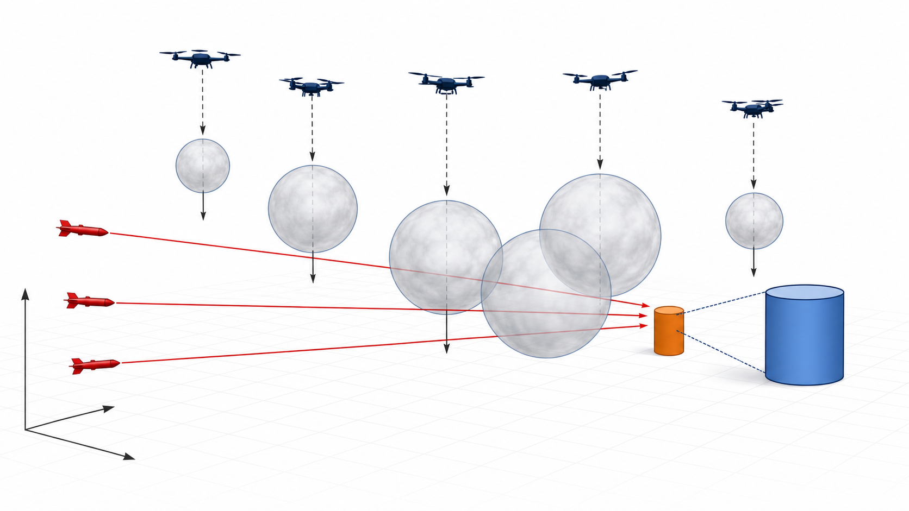
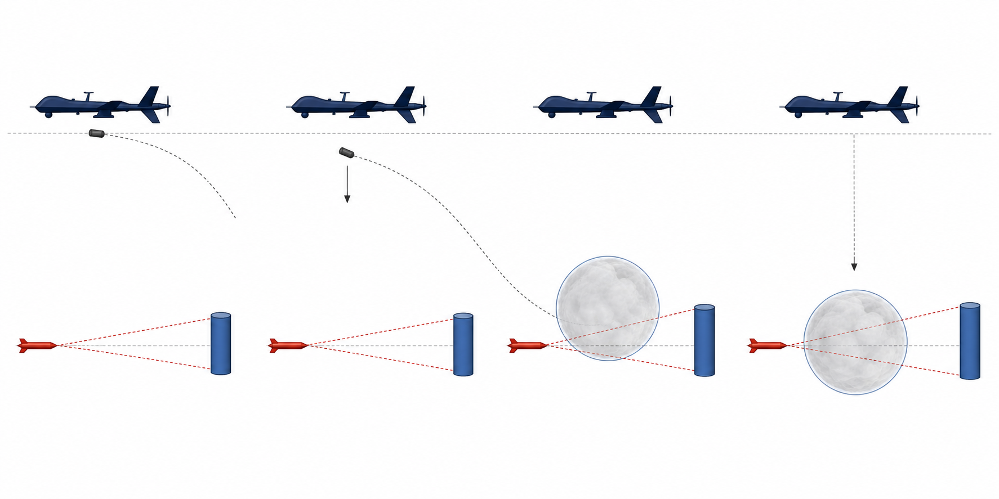

# 论文修改讨论清单（问题 3—5）

> 状态：先定技术叙事和图表位置，最终数值待 C 题参数恢复后重新运行并回填。当前不使用旧 A 题结果，也不使用尚未跑通的 `result1/2/3.xlsx` 数值。

## 一、先统一最终口径

1. 最终论文写 **2026 模拟赛 C 题**，不是 2025 A 题。必须统一为：云团下沉速度 2.5 m/s，无人机速度 80—120 m/s，问题 1 投放时刻 1.2 s、起爆延时 3.2 s。
2. 当前 `config.py` 处于“临时切回 A 题验证”状态，仍是 3.0 m/s、70—140 m/s、1.5 s、3.6 s。最终三问运行前必须恢复 C 题参数。
3. 当前 `result3.xlsx` 含 140 m/s，不能进入 C 题论文；`result1.xlsx`、`result2.xlsx` 的总时长为 0，也只能视为中间调试输出。
4. 论文不再声称“粒子群规模 5000、迭代 800”，而应写代码真实配置，并补充多次独立运行的均值、标准差和最优值。

## 二、问题 3 的重写重点

### 模型

- 决策向量固定为 8 维：
  \[
  \boldsymbol{x}_3=(\theta,v,t_1,\Delta t_2,\Delta t_3,\tau_1,\tau_2,\tau_3).
  \]
- 采用增量编码保证相邻投放间隔不小于 1 s：
  \[
  t_2=t_1+\Delta t_2,\qquad t_3=t_1+\Delta t_2+\Delta t_3.
  \]
- 多云团判定采用“关键点集合互补覆盖”，而不是“每枚弹独立完全遮蔽后做时间并集”：
  \[
  f_3(t)=\mathbf 1\!\left\{\bigcup_{m\in\mathcal A(t)}N_m(t)=K\right\}.
  \]
  这里 `K` 是圆柱目标的全部离散关键点，`N_m(t)` 是第 `m` 个有效云团在时刻 `t` 遮住的关键点集合。

### 算法

- 阶段 0：单弹 4 维 PSO 粗搜，获得热启动种子。
- 阶段 1：把单弹解复制成三弹错峰初值，再做 8 维联合 PSO 精修。
- 当前优化精度为 `dt=0.005 s`，目标表面使用 360 个方位点和 10 个侧面层，共 4320 个关键点；最终最优解建议再用更细时间步长和 8640 点复算一次。

### 论文中应增加

- 三枚弹的投放/起爆时序图；
- 三枚云团的遮蔽区间甘特图；
- 热启动前后收敛曲线对比；
- “三弹单独时长之和”和“联合有效时长”的差异说明。

## 三、问题 4 的重写重点

### 当前论文与代码的冲突

旧稿写“变步长搜索、三段遮蔽互不重叠后直接相加”，但当前代码实际是两阶段 PSO，且目标函数直接计算三机云团的联合遮蔽，不应预先假设区间不重叠。

### 建议正文写法

1. 阶段 1：分别求 FY1、FY2、FY3 的单机单弹最优策略，得到可接受基线解；
2. 阶段 2：以三个基线解为中心收缩 12 维边界，联合优化
   \[
   \boldsymbol{x}_4=(\theta_1,\theta_2,\theta_3,v_1,v_2,v_3,t_1,t_2,t_3,\tau_1,\tau_2,\tau_3);
   \]
3. 联合目标始终用时间网格上的遮蔽布尔并集/互补覆盖计算；只有最终结果确实互不重叠时，才能在结果分析中说明“联合时长等于三段时长之和”。

### 论文中应增加

- 阶段 1 基线与阶段 2 联合精修的结果对比；
- 三架无人机轨迹及三朵云团起爆点三维图；
- 三架无人机遮蔽区间甘特图；
- 12 维联合 PSO 收敛曲线。

## 四、问题 5 的重写重点

### 目标函数

明确采用“三枚导弹各自联合遮蔽时长之和”：
\[
F_5(\boldsymbol{x})=T_{M1}(\boldsymbol{x})+T_{M2}(\boldsymbol{x})+T_{M3}(\boldsymbol{x}).
\]
同一枚导弹由所有相关云团进行关键点互补覆盖判定，不同导弹之间再求和，避免口径混乱。

### 当前代码对应的算法

- 先按固定 `INTERCEPT_ORDER` 对每架无人机做 8 维单机三弹优化；
- 再围绕五个单机解构造 40 维局部邻域，进行五机联合 PSO 微调；
- 因为任务分配顺序目前是预先指定而非枚举优化，论文只能称“分层协同优化得到的较优方案”，暂不宜写“全局最优”。若后续代码加入任务分配枚举，再升级措辞。

### 论文中应增加

- 无人机—导弹任务分配矩阵；
- M1、M2、M3 三条遮蔽时间轴；
- 各导弹时长及总时长分解表；
- 五机 40 维联合优化收敛曲线；
- 任务分配或关键参数扰动下的稳定性分析。

## 五、全文联动修改

- 摘要：问题 3—5 的方法与结果全部按新代码重写，不沿用 7.6500 s、11.7540 s、38.0600/38.2 s。
- 问题分析：突出“多云团关键点互补覆盖”和“分层降维后联合精修”。
- 符号说明：统一 `t_r`（投放时刻）、`\tau`（引信延时）、`t_d=t_r+\tau`（起爆时刻），避免旧稿中 `t_f/t_d/t_r` 混用。
- 模型假设：删除“云团持续扩散”的说法；题设模型是瞬时形成半径 10 m 球形云团并匀速下沉，代码没有扩散半径模型。
- 模型检验：旧稿的 1.3916—1.3919 s 敏感性结论属于 A 题旧参数，不能直接搬到 C 题。
- 模型评价：增加“固定任务分配与局部搜索可能导致次优解”的局限性。
- 参考文献：旧稿三条参考文献存在信息不完整或疑似占位问题，最终需用可核验来源重做。
- 排版：当前“润色版”有大量机器同义替换、字词重叠、公式断裂与标题样式缺失，建议以 24 页同学稿的版面层级为参考，重新生成 Word，而不是继续在现有段落上小修补。

## 六、已生成的候选配图

### 图 A：多机多云团协同遮蔽机理

建议放在问题 3—5 共用模型开头。该图是概念示意，最终由 Word 图注补充“真目标、假目标、导弹、无人机、云团”等中文标签。

### 图 B：烟幕弹投放—起爆—下沉时序

建议放在公共运动学模型处。它只解释过程，实际轨迹、遮蔽区间和收敛曲线仍由代码结果生成。

## 七、等待最终结果后回填的表格

1. 问题 3：3 行烟幕弹策略表 + 单弹/联合遮蔽时长；
2. 问题 4：3 行无人机策略表 + 阶段 1/阶段 2 对比；
3. 问题 5：最多 15 行策略表 + `M1/M2/M3/总时长` 四项汇总；
4. 三问统一补充：PSO 粒子数、迭代数、随机种子、独立运行次数、均值、标准差、最好值、精细复算值。
